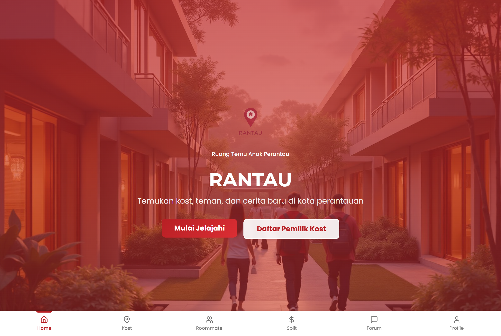

# RANTAU — Ruang Temu Anak Perantau

A web platform for students living away from home (*anak perantau*) in Bali: find a boarding house (*kost*), match with a compatible roommate, split shared bills, and connect through a community forum.



## Features

- **Smart Kost Finder** — search for a kost with an interactive quiz or a free explore mode, on an interactive map
- **Roommate Matching** — compatibility-based matching by lifestyle and habits
- **Bill Splitter & Reminders** — manage shared costs with housemates
- **Community Forum** — share stories and tips with fellow perantau
- **Personal profile & dashboard**

## Tech stack

React · Vite · TypeScript · Tailwind CSS · shadcn/ui · Framer Motion · React Leaflet

## Run locally

```bash
git clone https://github.com/GianneAngely/RANTAU.git
cd RANTAU
npm install
npm run dev
```

## Note

A build of RANTAU, our team concept for the **PRISMA Competition 2025**.
